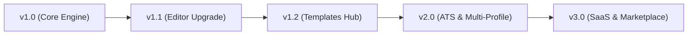

# FlowCV Studio — Product Roadmap & Version Release Strategy

**Document Version:** 1.0.0  
**Project:** FlowCV Studio (Next.js 15, React 19, TypeScript, Tailwind CSS v4, Shadcn UI)  
**Status:** Active Blueprint & Execution Plan

---

## Executive Summary

FlowCV Studio is designed to become the modern, ATS-friendly, vector-rendered CV/Resume engine and SaaS platform. This document outlines the structured version release strategy ($v1.0 \rightarrow v3.0$), detailing future milestones, dedicated template galleries, advanced visual editing features, and architectural specifications.

---

## Release Milestones & Version Breakdown

---

## Version 1.1: Advanced Visual Editor Suite

### 1. Enhanced Form & Section Management

- **Visual Inline Rich-Text Formatting:**
  - Real-time Markdown parser supporting `**bold**`, `*italic*`, `[links](url)`, `` `code` ``, and metric highlighting (e.g. `+45%`, `$1.2M`).
  - Bullet-point action-verb assistant with suggestions for strong impact words (e.g., _Architected_, _Spearheaded_, _Optimized_).
- **Drag-and-Drop Reordering:**
  - Reorder resume sections and experience item entries using smooth handle drag (`@dnd-kit/core`).
- **Dynamic Custom Section Creator:**
  - Support 4 dynamic schema section types:
    1. **Items Section:** Company, Title, Date Range, Location, Highlights (e.g., Experience, Education, Projects).
    2. **Key-Value Matrix:** Category and Skill badges (e.g., Core Languages, Frameworks, Cloud & DevOps).
    3. **List Section:** Single-line items with icons (e.g., Certifications, Honors & Awards, Speaking).
    4. **Text / Summary Section:** Rich-text paragraph with markdown support.
- **Contact & Arbitrary Social Link Manager:**
  - Unlimited custom links with auto-detected platform icons (GitHub, LinkedIn, Portfolio, Twitter/X, LeetCode, Substack, Play Store, Medium).

### 2. Micro-Styling & Layout Controls

- **Section Spacing & Density Sliders:**
  - Precise control over vertical section margins ($4\text{px} - 24\text{px}$), line-height ($1.15 - 1.6$), and bullet indentations.
- **Custom Color Palette Picker:**
  - Hex/HSL color picker for Primary Headings, Accent Lines, Link Highlights, and Background accents alongside preset palettes (_Slate_, _Royal Navy_, _Emerald_, _Indigo_, _Crimson_).
- **Typography & Font Pairings:**
  - Curated pairing presets (e.g., Sans Headings + Serif Body, Modern Geist + Inter, Classic Editorial).
- **Page Break Controller:**
  - Manual page break inserter (`print:break-after-page`) and auto-balance warning when content overflows page boundaries.

---

## Version 1.2: Dedicated Templates Hub & Discovery Page

### 1. `/templates` Gallery Route

- **Filterable Showcase Page:**
  - Categories: _Software & Tech_, _Academic & LaTeX_, _Executive & Leadership_, _Creative & Design_, _Compact 1-Page_.
  - Live interactive preview cards rendered in real-time with default user data.
- **1-Click Template Switching:**
  - Seamlessly switch active document template with instant state persistence.
- **Template Metadata & Metrics:**
  - ATS Compatibility Score ($95\% - 100\%$).
  - Recommended industry tags (e.g., FAANG, Finance, Research).

### 2. New Template Additions

- **`executive-split`:** Two-tone header with KPI highlight boxes.
- **`academic-cv`:** Multi-page publication-heavy format with numbered citation blocks.
- **`minimal-grid`:** 2-column balanced compact layout optimized for single-page junior/mid resumes.
- **`creative-developer`:** Modern tech format with embedded skill level indicators and dark/light print modes.

---

## Version 2.0: ATS Optimization & Multi-Resume Management

### 1. Real-Time ATS Score & Keyword Optimizer

- **ATS Parsing Engine:**
  - Real-time text-layer verification to ensure $100\%$ machine readability.
  - Job description matcher: Paste a job posting URL or text to receive keyword coverage analysis and missing skill suggestions.
- **Bullet Impact Scorer:**
  - Automated detection of quantified metrics (percentages, revenues, team sizes, latencies).

### 2. Multi-Profile & Version Checkpoints

- **Multiple Resume Profiles:**
  - Save multiple tailored resumes under one account (e.g., _"Senior Frontend Engineer"_, _"Fullstack Lead"_, _"Solutions Architect"_).
- **Version History & Rollback:**
  - Automatic snapshot creation before major edits with 1-click restore.

---

## Version 3.0: SaaS Platform, Public Profiles & Template Marketplace

### 1. Cloud Storage & Live Web Profiles

- **Public Shareable Web Resume:**
  - Host live resume at `flowcv.studio/u/username` with custom domain support.
  - Built-in visitor analytics (views, PDF download counts, geographic traffic).
- **Secure Cloud Sync:**
  - PostgreSQL + Prisma backend with Supabase/Clerk authentication.

### 2. Community Template Marketplace

- **Template Authoring SDK:**
  - Standardized JSON/React schema enabling community designers to build and publish custom templates.
- **Marketplace Monetization:**
  - Free and premium template store with creator revenue sharing.

---

## Feature Matrix & Implementation Priority

| Feature Area              | Component / Tool                        | Priority | Target Release |
| :------------------------ | :-------------------------------------- | :------: | :------------: |
| **Rich-Text Markdown**    | `FormattedText` / TipTap inline editor  |  **P0**  |      v1.1      |
| **Section Drag-and-Drop** | `@dnd-kit` Reorder in `EditorModal`     |  **P0**  |      v1.1      |
| **Templates Gallery**     | Dedicated `/templates` directory & page |  **P0**  |      v1.2      |
| **Custom Color Pickers**  | Radix / Shadcn Popover Color Picker     |  **P1**  |      v1.1      |
| **ATS Score Inspector**   | Client-side keyword & metric parser     |  **P1**  |      v2.0      |
| **Multi-Profile Storage** | LocalStorage + Cloud Sync Engine        |  **P1**  |      v2.0      |
| **Shareable Live URL**    | Next.js dynamic route `/u/[username]`   |  **P2**  |      v3.0      |
| **Template Marketplace**  | Community SDK & Stripe Integration      |  **P2**  |      v3.0      |

---

## Next Steps for Immediate Development (v1.1 Sprint)

1. Build visual drag-and-drop section reordering inside `EditorModal.tsx`.
2. Implement live custom color picker popover.
3. Scaffold the `/templates` showcase gallery page.
